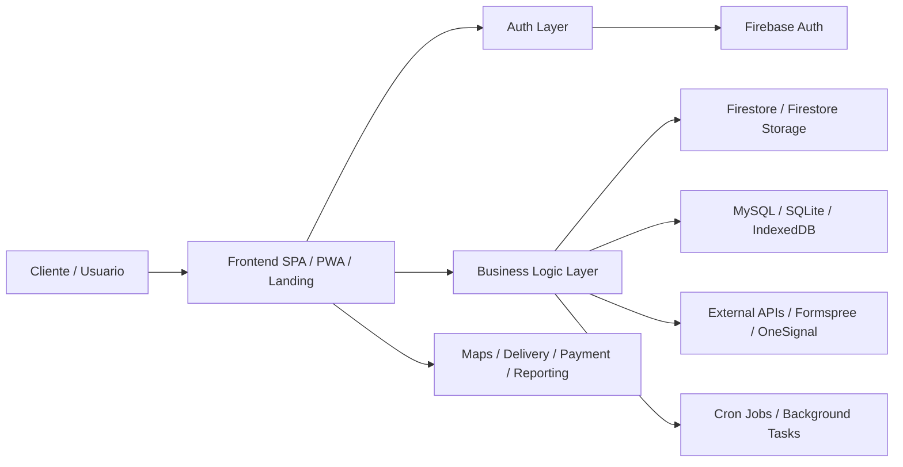
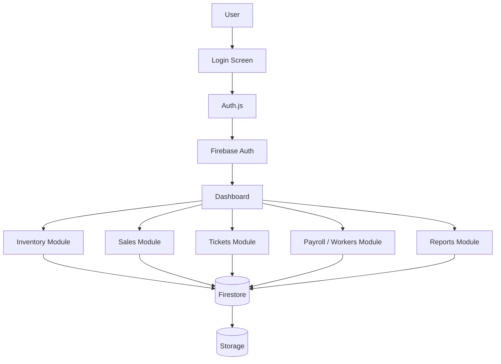
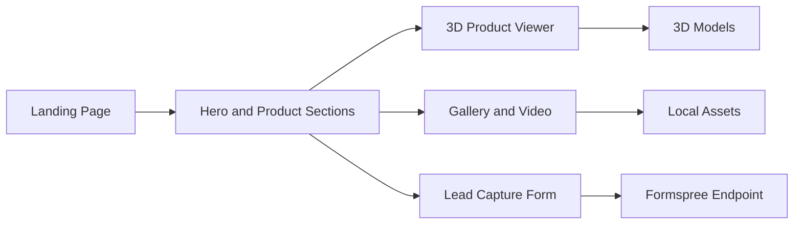
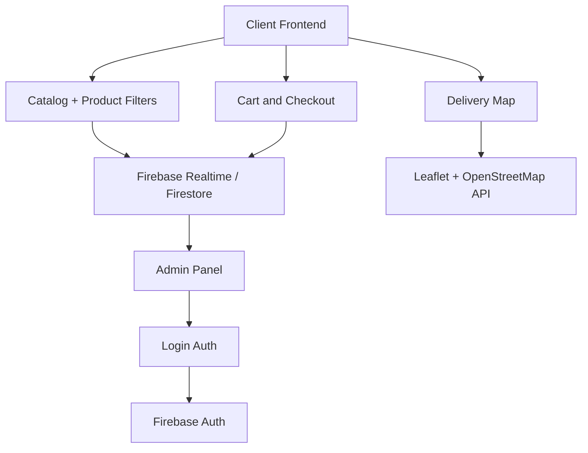
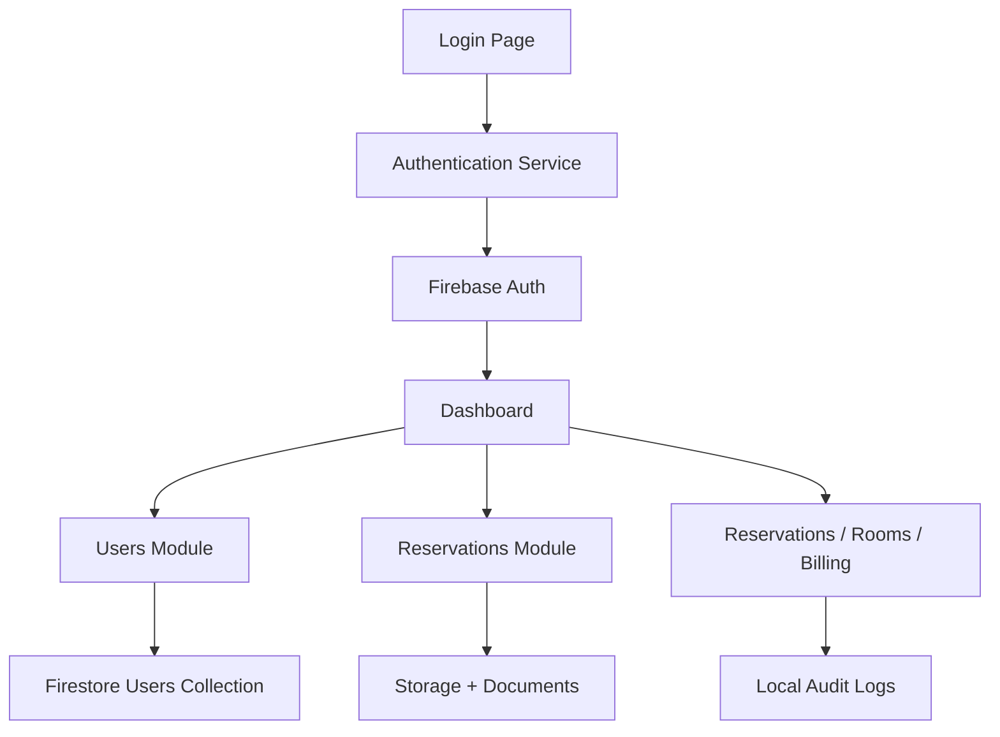
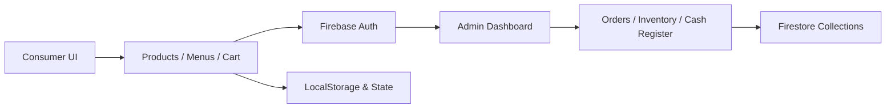
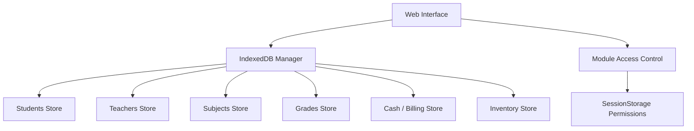
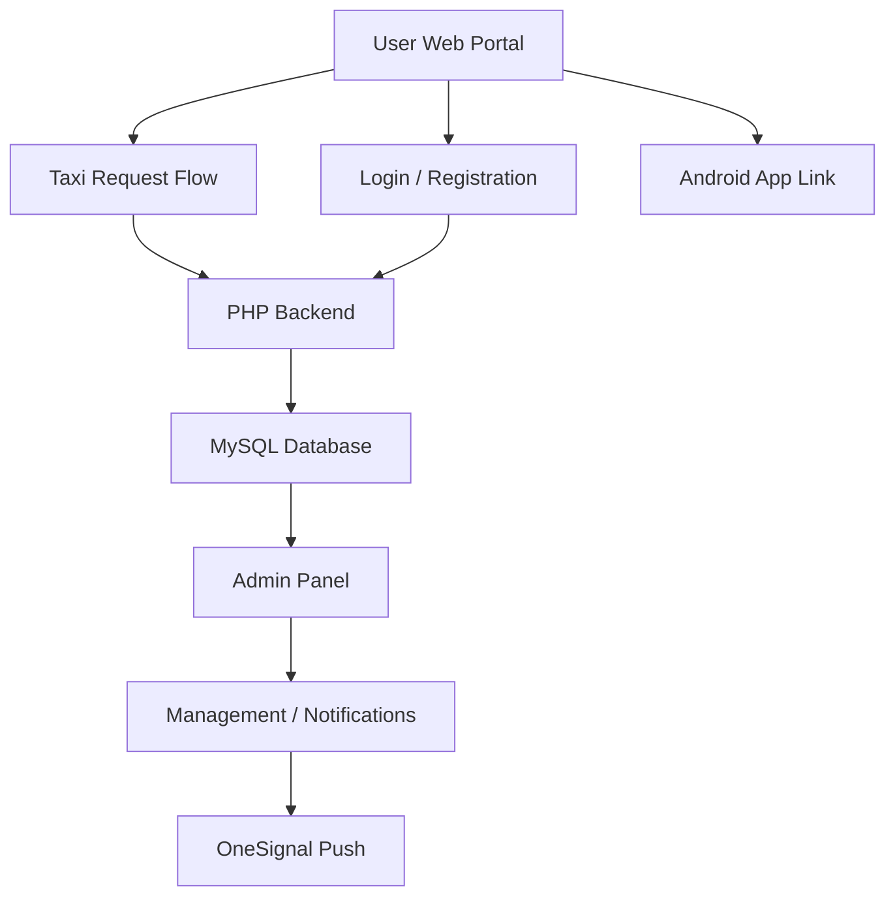

# José Manuel Laines Hernández
### Fullstack Developer | Software Architect | Digital Business Engineer

<p align="left">
  
  
  
</p>

<p align="center">
  
</p>

<div align="center">
  <a href="#resumen-ejecutivo">🇲🇽 Español</a> ·
  <a href="#english-version">🇺🇸 English</a>
</div>

---

## <a id="resumen-ejecutivo"></a>Resumen Ejecutivo

Ingeniero en Entornos Virtuales y Negocios Digitales con especialización en desarrollo de sistemas empresariales, e-commerce, gestión operativa, plataformas web y soluciones híbridas. Mi trabajo combina arquitectura de software, diseño de interfaces, integración con servicios cloud, automatización de procesos, y entrega de soluciones funcionales orientadas a la productividad del negocio.

He construido productos para restaurantes, hoteles, sistemas escolares, transportes, y plataformas empresariales, aplicando una lógica de desarrollo centrada en la escalabilidad, la experiencia de usuario y la optimización del flujo operativo.

- Cédula Profesional Federal: 15331523
- Idiomas: Español (Nativo), Inglés (C1 Avanzado)
- Formación: Ingeniería en Entornos Virtuales y Negocios Digitales + TSU en Tecnologías de la Información
- Ubicación: Emiliano Zapata, Tabasco, México

> Language selector: <a href="#resumen-ejecutivo">🇲🇽 Español</a> · <a href="#english-version">🇺🇸 English</a>

---

🔒 Source Code Policy / Política de Código Fuente

Los proyectos presentados en este portafolio corresponden a soluciones desarrolladas para entornos empresariales, comerciales, educativos y de servicios. Por razones de propiedad intelectual, seguridad y protección de los sistemas implementados, el código fuente completo de estos proyectos se mantiene privado y no se distribuye públicamente.

El objetivo de este repositorio es permitir que reclutadores, líderes técnicos y organizaciones puedan evaluar de manera transparente el alcance y la complejidad de mi trabajo sin exponer el código fuente propietario.

Para cada proyecto se proporciona, cuando corresponde:

* Arquitectura general del sistema.
* Estructura de directorios y organización del proyecto.
* Tecnologías y servicios utilizados.
* Variables, componentes y módulos principales.
* Descripción de funciones y responsabilidades.
* Flujos de autenticación, almacenamiento y procesamiento.
* Integraciones con APIs y servicios externos.
* Arquitectura de datos y persistencia.
* Lógica general de funcionamiento.
* Características funcionales del producto.
* Enlaces a implementaciones funcionales.
* Acceso mediante cuentas de demostración cuando están disponibles.

Las credenciales identificadas como Demo Credentials / Credenciales de demostración están destinadas exclusivamente a la evaluación funcional de los sistemas publicados y no representan acceso al código fuente.

Source Code: Private / Proprietary
Technical Documentation: Public
Architecture & Project Structure: Public
Functional Demos: Available where indicated
Demo Access: Available where indicated

English — Source Code Policy

The projects presented in this portfolio include software solutions developed for business, commercial, educational, and service environments. For intellectual property, security, and system protection reasons, the complete source code of these projects remains private and is not publicly distributed.

This repository is designed to allow recruiters, technical leads, and organizations to evaluate the scope, architecture, technical decisions, and complexity of my work without exposing proprietary source code.

Where applicable, each project provides technical architecture, directory structure, technology stack, major modules, key functions, system workflows, integrations, data persistence strategies, functional descriptions, live deployments, and dedicated demo access.

Demo credentials are provided solely for functional evaluation of the deployed systems and do not grant access to the underlying source code.
## <a id="english-version"></a>English Summary

Software engineer specialized in enterprise systems, e-commerce platforms, operational management, web solutions, and hybrid applications. My work combines software architecture, user experience design, cloud integration, process automation, and reliable delivery of digital products focused on business efficiency.

I have built projects for restaurants, hotels, schools, transportation services, and corporate platforms using scalable architectures, modern interfaces, and optimized business workflows.

---

## Core Stack

### Frontend & UI/UX


### Backend, APIs & Cloud


### Databases & Data Storage


### Mobile, Desktop & Hybrid Apps


### 3D, AR, VR & Gaming


### DevOps, Development & Collaboration Tools


### AI & Machine Learning


### Architecture, Methodologies & Engineering


---

## Architecture Overview



### Layered architecture used in most projects

1. Presentation layer
   - HTML5 + CSS3 + JavaScript
   - UI responsive and role-based
   - Single Page Applications and PWAs

2. Service layer
   - REST-like logic with `fetch`, `async/await` and `Firestore` collections
   - Firebase auth sessions, session persistence, and data validation

3. Data layer
   - Firestore / Realtime DB / IndexedDB / MySQL / SQLite
   - Files stored in Storage or LocalStorage depending on the system

4. Operations layer
   - Cron Jobs, notifications, ticket generation, reports and automation

---

## Professional Experience

### Marali Comunicaciones
#### Desarrollador Web Fullstack & E-commerce Lead
Period: Enero 2026 – Abril 2026
Location: Emiliano Zapata, Tabasco

- Desarrollo e implementación de una plataforma ERP interna orientada a administración operativa y un portal e-commerce independiente para venta y publicidad de productos empresariales.
- Integración de módulos para facturación, inventario, personal, compras, seguimiento de proyectos, emisión de tickets, pagos y reportes analíticos.
- Automatización con Cron Jobs para tareas de segundo plano y envío automático de notificaciones push asociadas a eventos del sistema.
- Reducción del tiempo de procesamiento de facturación y tickets en un 40% al centralizar procesos dispersos.
- Habilitación de un canal digital de ventas 24/7 con presencia independiente del comercio físico.

#### Technologies used
- HTML5, CSS3, JavaScript
- Node.js
- Firebase Cloud + Firebase Auth
- Formspree
- Cron Jobs
- Vercel

#### Impact
- Centralized fragmented business operations into one digital backend
- Improved reporting and process monitoring
- Enabled direct online sales and automated event notifications

---

## Portfolio Technical Overview

### 1. Marali Comunicaciones — ERP Administration + E-commerce
Repository path: `maralicomunicaciones-main/maralicomunicaciones-main`

#### System architecture


#### Folder structure
```text
maralicomunicaciones-main/
├── maralicomunicaciones-main/
│   ├── index.html
│   ├── dashboard.html
│   ├── crear-usuario-demo.html
│   ├── diagnostico.html
│   ├── README.md
│   ├── css/
│   │   └── style.css
│   ├── js/
│   │   ├── firebase-config.js
│   │   ├── auth.js
│   │   ├── api.js
│   │   ├── debug.js
│   │   └── modules/
│   │       ├── home.js
│   │       ├── inventario.js
│   │       ├── ventas.js
│   │       ├── historial.js
│   │       ├── trabajadores.js
│   │       ├── impuestos.js
│   │       ├── tickets.js
│   │       └── facturacion.js
│   └── assets/
```

#### Key variables and logic
- `firebaseConfig`: project credentials and service initialization
- `auth`: Firebase authentication singleton
- `db`: Firestore instance
- `storage`: Cloud Storage instance
- `Timestamp`: Firestore timestamp helper for temporal data

#### Main functions
- `loginUser(email, password)` — validates credentials and keeps session alive
- `createProducto(productoData, userId)` — inserts product into Firestore
- `getProductos(userId)` — returns product list with filtered ordering
- `updateProducto(productoId, updatedData)` — modifies product data
- `deleteProducto(productoId)` — removes records safely
- `uploadFile(file, path)` — uploads binary data and returns public URL
- `getCurrentUser()` / `getUserData()` — retrieves authenticated user data

#### Access links
- Main app: https://manuelasus.github.io/maralicomunicaciones/index.html
- Credentials: Usuario: `admin` | Correo: `admin123`

---

### 2. Marali Comunicaciones — Business Landing / Storefront
Repository path: `MaraliComunicacionesitiodecompras-main/MaraliComunicacionesitiodecompras-main`

#### System architecture


#### Folder structure
```text
MaraliComunicacionesitiodecompras-main/
├── MaraliComunicacionesitiodecompras-main/
│   ├── Index.html
│   ├── style.css
│   ├── 3D/
│   │   ├── PanelSolar.glb
│   │   ├── CamaraEpcom.glb
│   │   ├── Camara CS-H52.glb
│   │   └── ...
│   ├── Imagenes/
│   ├── videos/
│   └── README.md
```

#### Key features
- Product experience using `model-viewer`
- High-impact marketing sections for installation and solar systems
- Interactive 3D model switch using `changeModel(button, modelPath)`
- Form integration with Formspree for lead generation

#### Access link
- Storefront: https://manuelasus.github.io/MaraliComunicacionesitiodecompras/Index.html

---

### 3. Carlo's Pizza — Delivery + POS + Restaurant Commerce
Repository path: `carlospizza-main/carlospizza-main`

#### System architecture


#### Folder structure
```text
carlospizza-main/
├── carlospizza-main/
│   ├── README.md
│   ├── SISTEMA-TIEMPO-REAL-DOCUMENTACION.md
│   ├── web/
│   │   ├── index.html
│   │   ├── admin/
│   │   │   ├── login.html
│   │   │   └── dashboard.html
│   │   ├── css/
│   │   ├── js/
│   │   │   ├── firebase-config.js
│   │   │   ├── main.js
│   │   │   ├── mapas-mejorado.js
│   │   │   └── ...
│   │   ├── manifest.json
│   │   └── sw.js
│   ├── LOGO/
│   ├── MENU/
│   ├── MENUS/
│   ├── IMAGENESDECOMIDA...
│   └── DATOSDEPAGOCAROLASGREEN/
```

#### Main variables and logic
- `firebaseConfig`: cloud configuration for App, Firestore and Storage
- `misPedidos`: local cart list stored in `localStorage`
- `mapaInstanciaCliente`, `marcadorUsuario`, `polylineRepartidor`: route tracking variables used for map delivery flow
- `filtro` state for category filtering in product grid

#### Main functions
- `cargarProductos()` — loads product list by category
- `agregarAlCarrito(producto)` — updates cart state and totals
- `calcularTotal()` — calculates total from cart
- `renderCarrito()` — DOM rendering of cart items
- `procederCompra()` — opens checkout modal
- `renderMapaEntrega()` — computes route to user location using Leaflet
- `registrarPedido()` — creates checkout and payment event

#### Access links
- Public site: https://manuelasus.github.io/carlospizza/web/index.html
- Admin login: https://manuelasus.github.io/carlospizza/web/admin/login.html
- Credentials: Email: `admin@carlospizza.com` | Password: `admin123456`

---

### 4. Hotel Casa Usumacinta — Hotel ERP + Customer Management
Repository path: `hotelusumacinta-main/hotelusumacinta-main`

#### System architecture


#### Folder structure
```text
hotelusumacinta-main/
├── hotelusumacinta-main/
│   ├── index.html
│   ├── login.js
│   ├── dashboard.html
│   ├── dashboard.js
│   ├── agregarusuario.html
│   ├── agregarusuario.js
│   ├── edicionusuarios.js
│   ├── config.js
│   ├── utils.js
│   ├── scripts/
│   ├── firebasedatosdeconexion/
│   ├── LOGO/
│   ├── paleta/
│   ├── FOTOPORTADAHOTEL/
│   ├── IMAGENESINTERIORESDELHOTEL/
│   ├── README.md
│   └── web/
```

#### Key variables and logic
- `firebaseConfig`: Firebase credentials for app initialization
- `stream`: camera media stream for login verification
- `fotoCapturada`: security flag used to validate photo capture
- `usuarioData`: object with user profile retrieved from Firestore

#### Main functions
- `handleLogin(event)` — validates credentials and starts identity capture
- `iniciarCapturaDeFoto(userId)` — accesses the camera and prepares login evidence
- `capturarFoto(userId)` — stores a Base64 image in Firestore
- `handleForgotPassword(event)` — sends recovery request to Formspree
- `mostrarMensaje(message, type)` — creates reusable feedback UI state

#### Access links
- Public site: https://manuelasus.github.io/hotelusumacinta/web/
- Admin site: https://manuelasus.github.io/hotelusumacinta/
- Credentials: Usuario: `HotelCasaUsumacinta` | Contraseña: `casausumacinta2026`

---

### 5. Carolas Green — Organic Food PWA + POS
Repository path: `carolasgreen-main/carolasgreen-main`

#### System architecture


#### Folder structure
```text
carolasgreen-main/
├── carolasgreen-main/
│   ├── README.md
│   ├── SISTEMA-TIEMPO-REAL-DOCUMENTACION.md
│   ├── web/
│   │   ├── index.html
│   │   ├── admin/
│   │   │   └── login.html
│   │   ├── css/
│   │   ├── js/
│   │   ├── manifest.json
│   │   └── sw.js
│   ├── LOGO/
│   ├── MENU/
│   ├── MENUS/
│   ├── IMAGENESDELATIENDA/
│   └── ...
```

#### Main characteristics
- Product catalog with category filtering
- Cart logic and checkout flow
- Restaurant ordering UI with digital menus and POS logic
- PWA optimization using service worker and manifest file

#### Access link
- Main app: https://manuelasus.github.io/carolasgreen/web/
- Credentials: Email: `admin@carolasgreen.com` | Password: `admin123456`

---

### 6. CEPCI — Offline School Management System
Repository path: `sistemacepci-main/sistemacepci-main`

#### System architecture


#### Folder structure
```text
sistemacepci-main/
├── sistemacepci-main/
│   ├── index.html
│   ├── dashboard.html
│   ├── administrador.html
│   ├── registroalumnos.html
│   ├── maestros.html
│   ├── vermaterias.html
│   ├── grupos.html
│   ├── caja.html
│   ├── pagos.html
│   ├── inventario.html
│   ├── copiadeseguridad.html
│   ├── js/
│   │   ├── db.js
│   │   ├── index.js
│   │   ├── jspdf-simple.js
│   │   └── jspdf.min.js
│   ├── css/
│   ├── img/
│   ├── users.json
│   ├── registroalumnos.json
│   └── README.md
```

#### Key variables and logic
- `DB_NAME`, `DB_VERSION`: database identity and migration version
- `PAGE_MODULE_MAP`: maps each HTML page to a logical module
- `sessionStorage.permissions`: role-based access control state
- `db`: IndexedDB instance

#### Main functions
- `initIndexedDB()` — creates object stores and schema
- `verificarUsuarioPorDefecto()` — auto-creates default admin user
- `guardarImagen()` / `obtenerImagen()` — stores/retrieves blobs in IndexedDB
- `checkModuleAccess()` — validates user privileges by module
- `enforceCurrentPageAccess()` — blocks unauthorized pages
- `resetearSistemaCompleto()` — hard reset for local data and configuration

#### Access link
- App: https://manuelasus.github.io/sistemacepci/
- Credentials: Usuario: `AdminCepci01` | Contraseña: `AdministracionCepci`

---

### 7. Sitio GL Palenque — Taxi Portal + Admin + App Ecosystem
Repository path: `taxissitiogl`

#### System architecture


#### Folder structure
```text
taxissitiogl/
├── default.php
├── index.php
├── loginadmin.php
├── sw.js
├── wp-cron.php
├── robots.txt
├── sitemap.xml
├── www/
│   ├── index.php
│   ├── login.php
│   ├── loginadmin.php
│   ├── administrador.php
│   ├── choferlogin.php
│   ├── solicitar_taxi.php
│   ├── mi_cuenta.php
│   ├── serviciosn.html
│   ├── detalle*.html
│   ├── css/
│   ├── js/
│   ├── img/
│   ├── uploads/
│   ├── OneSignalSDK*.js
│   └── ...
├── backend.py
├── crear_bd.py
├── usuarios.sql
└── firebase.txt
```

#### Main variables and logic
- `$pdo`: PDO instance connected to MySQL
- `$_SESSION['admin']`: admin authentication state
- `$_SESSION['comentarios_mostrados']`: controls rotating comments display
- `OneSignal.init(...)`: notification configuration for push alerts

#### Main functions and flows
- `loginadmin.php` — admin login validation against MySQL table `Administrador`
- `solicitar_taxi.php` — user request submission flow
- `notificar_llegada.php` — sends notification to driver or passenger
- `comentarios` query — selects and rotates review content
- `logout.html` — ends current session

#### Access links
- Web portal: https://sitioglpalenque.page.gd/www/index.php
- Admin portal: https://sitioglpalenque.page.gd/www/loginadmin.php
- App Store: https://play.google.com/store/apps/details?id=com.jmlh.taxiapp&pcampaignid=web_share
- Credentials: Usuario: `5522100159@utusumacinta.edu.mx` | Contraseña: `27dpro403X` | Teléfono: `9341266283`

---

## Technical Summary by Business Type

| Business Type | Architecture | Main Stack | Core Function |
| --- | --- | --- | --- |
| Restaurant / Ecommerce | SPA + Admin + Cloud | HTML, JS, Firebase, Service Worker | Orders, cart, delivery, POS |
| Hotel | ERP + CRM + Identity | Firebase, HTML, JS, Storage | Reservations, users, documents |
| School | Offline ERP | IndexedDB, JS, HTML | Academic management, grades, payments |
| Taxi Platform | Web + Admin + PHP | PHP, MySQL, OneSignal | Booking, tracking, driver management |
| Corporate Commerce | Landing + 3D Product Viewer | HTML, CSS, JS, model-viewer | Product showcase and lead capture |

---

## Strategic Value Delivered

This portfolio demonstrates a full-cycle software engineering profile focused on:

- business process automation
- e-commerce operations
- admin dashboards and reporting
- offline-first systems
- cloud-based ecosystems with Firebase
- PWA / multi-platform product delivery
- backend integration with external notification services and APIs

The result is a technical persona capable of turning business needs into digitally optimized solutions, from idea and architecture to deployment and operational continuity.

---

## Quick Access Links

- Marali Comunicaciones: https://manuelasus.github.io/maralicomunicaciones/index.html
- Marali Comunicaciones Store: https://manuelasus.github.io/MaraliComunicacionesitiodecompras/Index.html
- Carlo's Pizza: https://manuelasus.github.io/carlospizza/web/index.html
- Carlo's Pizza Admin: https://manuelasus.github.io/carlospizza/web/admin/login.html
- Hotel Casa Usumacinta: https://manuelasus.github.io/hotelusumacinta/web/
- Hotel Casa Usumacinta Admin: https://manuelasus.github.io/hotelusumacinta/
- Carolas Green: https://manuelasus.github.io/carolasgreen/web/
- CEPCI System: https://manuelasus.github.io/sistemacepci/
- Sitio GL Palenque: https://sitioglpalenque.page.gd/www/index.php
- Sitio GL App: https://play.google.com/store/apps/details?id=com.jmlh.taxiapp&pcampaignid=web_share

---

## Contact

- WhatsApp: [+52 934 126 6283](https://wa.me/529341266283)
- Location: Emiliano Zapata, Tabasco, México
- Email: [laineshernandezjosemanuel@gmail.com](mailto:laineshernandezjosemanuel@gmail.com)
- GitHub: [github.com/JoseManuelLainesHernandez](https://github.com/JoseManuelLainesHernandez)
- LinkedIn: [José Manuel Laines Hernández](https://www.linkedin.com/in/josé-manuel-laines-hernández-467474327?utm_source=share_via&utm_content=profile&utm_medium=member_ios)


> Engineering focused on digital transformation, business automation, and product delivery with measurable impact.
